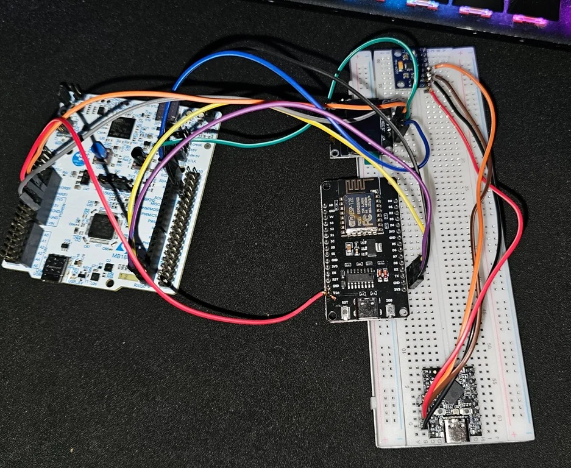
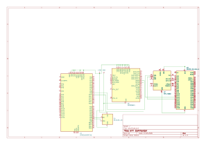

# WIFI Commander
A network administration tool designed specifically for OpenWRT routers.

:::info

**Author**: Ciuraru Mircea-Georgian \
**GitHub Project Link**: https://github.com/UPB-PMRust-Students/fils-project-2026-ciurix

:::

<!-- do not delete the \ after your name -->

## Description

**WIFI Commander** is a portable network administration system controlled by hand gestures. The handheld wand uses an ESP32-S3 and an MPU6050 to recognize physical "spells" with a neural network running directly on the microcontroller. Once a gesture is recognized, its spell name is broadcast over ESP-NOW to the rest of the system.

The received spell is shown on the controller's OLED and can also be translated into a real OpenWRT administration command by the laptop-side router manager. No cloud service or phone is required for gesture recognition.

The current gesture-to-action mapping is:

| Gesture | Spell | Network action |
|---|---|---|
| Sweep left | `LEFT` | Select previous OpenWRT interface |
| Sweep right | `RIGHT` | Select next OpenWRT interface |
| Sweep up | `UP` | Bring the selected interface up |
| Sweep down | `DOWN` | Bring the selected interface down |
| Thrust forward | `PUSH` | Run an `iperf3` UDP stress test |
| Draw a circle | `CIRCULAR` | Create an OpenWRT configuration backup |

## Motivation

My drive to help people made me learn a lot about OpenWRT routers in order to build custom images for people living in the dorms. Diagnosing and maintaining routers often means repeatedly connecting to them and running the same administrative commands.

WIFI Commander turns those operations into physical gestures, creating a portable "God Mode" remote for common network administration and diagnostic tasks. Besides being useful, the project combines embedded Rust, wireless communication, TinyML, sensor processing, serial communication and real OpenWRT administration in one system.

## Architecture

The final implementation is distributed across the wand, a radio bridge, an STM32 display controller and a laptop-side router manager:

```text
                         ESP-NOW, channel 1
+-------------------+         broadcast         +-------------------+
| WIFI Wand         | ------------------------> | NodeMCU ESP8266   |
| ESP32-S3          |                           | radio bridge      |
| MPU6050           |                           +---------+---------+
| int8 CNN          |                                     |
+-------------------+                         +-----------+-----------+
                                              |                       |
                                       UART1 115200             USB serial
                                              |                       |
                                              v                       v
                                    +-------------------+   +-------------------+
                                    | STM32U545RE-Q     |   | Laptop manager    |
                                    | SSD1306 OLED      |   | Python + Paramiko |
                                    +-------------------+   +---------+---------+
                                                                      |
                                                                     SSH
                                                                      |
                                                                      v
                                                            +-------------------+
                                                            | OpenWRT 24.10     |
                                                            | router            |
                                                            +-------------------+
```


### WIFI Wand

The wand is built around an **ESP32-S3 SuperMini** and an **MPU6050**. It samples all six motion channels (3-axis acceleration + 3-axis gyroscope) at **50 Hz** and stores a rolling window of **128 samples**, representing **2.56 seconds** of motion.

Instead of using only fixed motion thresholds, the current implementation runs a small **int8-quantized convolutional neural network** directly on the ESP32-S3. The network is evaluated every 10 samples (about five times per second). A spell is accepted when the model reports at least **80% confidence**.

To reduce false or repeated detections, the firmware also uses:

- a motion gate that skips windows without enough real movement;
- a roughly **1.5 second cooldown** after a successful cast;
- a planned `negative` training class for motions that are not valid spells.

Recognized spells are broadcast using **ESP-NOW on channel 1**. Broadcast packets are used so the receiver MAC address does not have to be hard-coded into the wand.

### NodeMCU Radio Bridge

The **ESP8266 NodeMCU** receives the ESP-NOW broadcasts from the wand. It then forwards the spell in two directions:

- through **UART1 at 115200 baud** to the STM32 controller;
- through its USB serial connection, where the laptop router manager can read it.

This is the only firmware component written in C++. The ESP8266 Wi-Fi radio depends on Espressif's C SDK and the Rust ESP radio stack used by the project supports the ESP32 family, not the ESP8266.

### STM32 Controller

The **NUCLEO-U545RE-Q** receives spell names from the NodeMCU using **LPUART1** on PA3 / Arduino D0. It drives a **128x64 SSD1306 OLED** over I2C using PB6/PB7 (Arduino D15/D14).

At boot, the controller probes the expected OLED addresses (`0x3C` and `0x3D`) and scans the I2C bus if no display responds. It then shows a short boot animation containing the configured Wi-Fi network name and waits for spells.

When a spell arrives, the display shows both the spell and the action mapped to it. Keeping the spell-to-action table on the controller means the displayed meaning of a gesture can be changed without retraining the neural network.

### OpenWRT Router Manager

Actual router administration is performed by `controller/manager/manager.py` on a laptop connected to the router. This design was chosen because SSH requires a full cryptographic stack and substantially more memory than the ESP8266, while there is no suitable `no_std` SSH stack for the STM32 used here.

The manager reads spell messages from the NodeMCU USB serial connection and uses **Paramiko** to connect to **OpenWRT 24.10 over SSH**. It first discovers logical interfaces using:

```bash
ubus call network.interface dump
```

The current command mapping is:

| Spell | Implemented command/action |
|---|---|
| `LEFT` | Select previous logical interface |
| `RIGHT` | Select next logical interface |
| `UP` | `ifup <selected>` |
| `DOWN` | `ifdown <selected>` |
| `PUSH` | `iperf3 -u -b 100M -t 5 -c <IPERF_SERVER>` |
| `CIRCULAR` | `sysupgrade -b /tmp/openwrt-backup.tar.gz` |

The manager starts in **dry-run mode by default**, so it prints the commands it would execute without modifying the router. Router credentials, serial port settings and the `iperf3` target are stored in a gitignored `.env` file rather than being hard-coded.

## Log

### Week 8
* **Research & Architecture Phase:** Completed research on the hardware and software architecture.
* Investigated Digital Signal Processing (DSP) and complementary filters for the MPU6050 sensor to accurately recognize hand gestures and filter out tremors.
* Selected the **ESP-NOW** protocol for ultra-low latency wireless communication between the Wand and the Base Controller.
* Explored the OpenWRT `ubus` HTTP API for executing remote network administration commands without relying on SSH.

### Week 9
* **Hardware Procurement:** Finalized the complete Bill of Materials (BOM).
* Officially placed orders for all necessary hardware components (ESP32-S3 SuperMini, ESP8266 NodeMCU, MPU6050, TP4056 modules, Li-Po battery, jumper wires, etc.) from suppliers.
* Currently awaiting delivery of the components to begin breadboard testing and initial hardware assembly.

### Week 10
* Components have arrived and have started breadboard testing with some success.
* Started writing software for the WIFI Wand, struggling with the MPU6050 and clean data from it.

### Week 11 
* Finalized hardware wiring and testing on a breadboard. Will need to start finishing the software side.

### Week 12 *(Current Week)*
*(To be filled during development)*

### Week 13
*(To be filled during development)*

### Week 14
*(To be filled during development)*

## Restanță

The work below was completed later, during the restanță period, and is intentionally kept separate from the original weekly progression above.

### TinyML gesture recognition

- Added dedicated gesture-capture firmware for recording training samples directly from the wand.
- Built an offline TensorFlow training pipeline for accelerometer and gyroscope recordings.
- Replaced the earlier threshold/filtering approach with an **on-device CNN** compiled into the ESP32-S3 firmware using **MicroFlow**.
- Added full **int8 quantization** so inference can run efficiently on the microcontroller.
- Added motion gating, confidence filtering and a cooldown to reduce false or repeated casts.

### Wireless link and display controller

- Implemented ESP-NOW broadcasting from the ESP32-S3 wand on channel 1.
- Added the ESP8266 NodeMCU bridge to receive ESP-NOW packets and forward spell names through UART and USB serial.
- Implemented the STM32 controller firmware with Embassy, LPUART1 reception and SSD1306 OLED output.
- Added OLED address probing, I2C diagnostics and a boot animation.
- Reached a working end-to-end embedded path where a recognized gesture on the wand appears as the corresponding spell/action on the controller display.

### OpenWRT integration

- Added the Python router manager for translating received spells into OpenWRT actions.
- Added SSH communication using Paramiko and automatic logical-interface discovery using `ubus call network.interface dump`.
- Implemented interface selection, `ifup`, `ifdown`, `iperf3` stress testing and OpenWRT configuration backups.
- Added a safe dry-run mode and moved credentials/configuration into a gitignored `.env` file.
- Added test/self-test paths to help debug the radio and downstream command pipeline independently from gesture recognition.

### Current status

The embedded gesture path is working end to end: a gesture recognized on the ESP32-S3 is broadcast over ESP-NOW, received by the NodeMCU and displayed by the STM32 controller.

The training data and compiled model currently contain **four gesture classes: `DOWN`, `LEFT`, `RIGHT` and `UP`**. The firmware and router manager already define mappings for `PUSH` and `CIRCULAR`, but those gestures still need to be recorded and added to the model. A varied `negative` class is also still needed so the model can explicitly learn to reject movements that are not spells.

The OpenWRT manager and SSH command mappings are implemented. It runs in dry-run mode by default so the complete command flow can be checked safely before enabling live router changes.

## Hardware

The hardware is split into a lightweight handheld wand, a radio bridge and a stationary display controller. A laptop performs the SSH connection to the OpenWRT router.



### Schematics



### Bill of Materials

| Device | Usage | Price |
|--------|-------|-------|
| [STM32U545RE-Q](https://www.mouser.com/ProductDetail/STMicroelectronics/NUCLEO-U545RE-Q?qs=mELouGlnn3cp3Tn45zRmFA%3D%3D) | Receives spells over LPUART1 and drives the OLED user interface. | [125 RON](https://www.mouser.com/ProductDetail/STMicroelectronics/NUCLEO-U545RE-Q?qs=mELouGlnn3cp3Tn45zRmFA%3D%3D) |
| [ESP32-S3 SuperMini](https://www.aliexpress.com/item/1005010580012002.html?spm=a2g0o.order_list.order_list_main.124.3db91802MOlxcU) | Samples the MPU6050, runs the TinyML model and broadcasts recognized spells over ESP-NOW. | [33 RON](https://www.aliexpress.com/item/1005010580012002.html?spm=a2g0o.order_list.order_list_main.124.3db91802MOlxcU) |
| [ESP8266 NodeMCU](https://www.aliexpress.com/item/1005007622551989.html?spm=a2g0o.order_list.order_list_main.46.3db91802MOlxcUl) | ESP-NOW radio bridge; forwards spells to the STM32 over UART and to the laptop over USB serial. | [23 RON](https://www.aliexpress.com/item/1005007622551989.html?spm=a2g0o.order_list.order_list_main.46.3db91802MOlxcU) |
| [MPU6050 Module](https://www.aliexpress.com/item/1005008796700745.html?spm=a2g0o.order_list.order_list_main.112.3db91802MOlxcU) | Six-axis accelerometer and gyroscope used as the gesture sensor. | [19 RON](https://www.aliexpress.com/item/1005008796700745.html?spm=a2g0o.order_list.order_list_main.112.3db91802MOlxcU) |
| [OLED 0.96" I2C](https://www.aliexpress.com/item/1005006901360788.html?spm=a2g0o.order_list.order_list_main.82.3db91802MOlxcU) | 128x64 controller display showing the configured network, spells and mapped actions. | [15 RON](https://www.aliexpress.com/item/1005006901360788.html?spm=a2g0o.order_list.order_list_main.82.3db91802MOlxcU) |
| [TP4056 Type-C (x2)](https://www.aliexpress.com/item/1005006913369310.html?spm=a2g0o.order_list.order_list_main.11.3db91802MOlxcU) | Li-Po charging modules for portable power/prototyping. | [26 RON (13 RON ea.)](https://www.aliexpress.com/item/1005006913369310.html?spm=a2g0o.order_list.order_list_main.11.3db91802MOlxcU) |
| [Li-Po Battery 90mAh/250mAh](https://www.emag.ro/baterie-li-po-akyga-lp601730-3-7v-250mah-cu-conector-jst-2-pini-150mm-aky0384/pd/D5J3023BM/) | Portable power source for the wand. | [25 RON](https://www.emag.ro/baterie-li-po-akyga-lp601730-3-7v-250mah-cu-conector-jst-2-pini-150mm-aky0384/pd/D5J3023BM/) |
| [Extras](https://www.aliexpress.com/item/1005007833517016.html?spm=a2g0o.order_list.order_list_main.52.73e51802Sp70iH) | MB-102 breadboard and M-M / M-F Dupont wires. | [53 RON](https://www.aliexpress.com/item/1005007833517016.html?spm=a2g0o.order_list.order_list_main.52.73e51802Sp70iH) |
| **Total** | | **319 RON** |

The 90 mAh battery shown in the original architecture was already owned. A 250 mAh battery was also ordered as an alternative for the final wand.

## Software

The project is mostly written in Rust. The ESP8266 bridge is written in C++ because of its Wi-Fi SDK limitation, while the OpenWRT manager is Python because it needs desktop-class SSH support.

| Library / Tool | Description | Usage |
|---|---|---|
| [esp-hal](https://github.com/esp-rs/esp-hal) | Bare-metal HAL for Espressif chips | ESP32-S3 GPIO, I2C, timing and peripherals |
| [esp-radio](https://github.com/esp-rs/esp-hal) | Espressif radio stack for the current `esp-hal` generation | ESP-NOW transmission from the wand |
| [esp-rtos](https://crates.io/crates/esp-rtos) | Runtime/scheduler support for ESP radio services | Starts the scheduler required by the ESP-NOW radio stack |
| [MicroFlow](https://crates.io/crates/microflow) | TinyML inference engine for embedded Rust | Compiles and executes the quantized `.tflite` CNN on the ESP32-S3 |
| [nalgebra](https://crates.io/crates/nalgebra) | Linear algebra library | Math types required by the generated MicroFlow model |
| [Embassy](https://embassy.dev/) | Async embedded framework | STM32U545RE-Q executor, timing and peripheral drivers |
| [ssd1306](https://crates.io/crates/ssd1306) | SSD1306 OLED driver | Initializes and drives the 128x64 OLED |
| [embedded-graphics](https://crates.io/crates/embedded-graphics) | Embedded 2D graphics library | Renders text, separators and the boot progress bar |
| [TensorFlow](https://www.tensorflow.org/) | Machine-learning framework | Offline CNN training and int8 TFLite export |
| [pyserial](https://pyserial.readthedocs.io/) | Python serial library | Reads spell messages from the NodeMCU USB serial port |
| [Paramiko](https://www.paramiko.org/) | Python SSH implementation | Executes OpenWRT commands remotely from the laptop manager |

### Gesture Training Pipeline

The model is trained offline from recordings captured with the actual wand:

```text
capture.rs
   ↓
data/*.txt
   ↓
train/train_spells.py
   ↓
model/spells.tflite + model/labels.txt
   ↓
MicroFlow model compiled into ESP32-S3 firmware
```

Each recording contains a 128-sample motion window. The training script adds time-shifted/noisy augmentation, splits the data into training/validation/test sets, trains the CNN, prints a confusion matrix and exports a fully int8-quantized TFLite model.

The CNN intentionally uses only operators supported by MicroFlow: `Conv2D`, `DepthwiseConv2D`, `FullyConnected`, `AveragePool2D`, `Reshape`, ReLU/ReLU6 and Softmax. The export script also verifies the final TFLite operator list and enforces per-tensor quantization where required.

## Wiring Summary

### Wand

| MPU6050 | ESP32-S3 |
|---|---|
| SDA | GPIO12 |
| SCL | GPIO13 |
| VCC | 3V3 |
| GND | GND |

### NodeMCU to STM32

| NodeMCU | STM32 |
|---|---|
| D4 / GPIO2 / UART1 TX | D0 / PA3 / LPUART1 RX |
| GND | GND |

The NodeMCU should be powered from its own USB connection or the Nucleo's **5V** pin rather than the Nucleo 3.3V rail, because Wi-Fi transmit current spikes can cause brownouts.

### STM32 to OLED

| OLED | NUCLEO-U545RE-Q |
|---|---|
| SCL | D15 / PB6 |
| SDA | D14 / PB7 |
| VCC | 3V3 |
| GND | GND |

## Links

1. [Embassy - the async Rust framework](https://embassy.dev/) - Used for the STM32 controller firmware.
2. [The Rust on ESP Book](https://docs.esp-rs.org/book/) - Reference for bare-metal Rust on ESP32 devices.
3. [MicroFlow](https://crates.io/crates/microflow) - TinyML inference engine used to run the quantized gesture model on the ESP32-S3.
4. [OpenWRT ubus documentation](https://openwrt.org/docs/techref/ubus) - Used by the router manager to discover logical interfaces.
5. [Paramiko](https://www.paramiko.org/) - SSH library used by the laptop-side OpenWRT manager.
6. [Inspiration: Pedometer ESP32 implemented in Rust](https://www.youtube.com/watch?v=qpRlkYwzalA) - Related ESP32 + MPU6050 embedded Rust project.